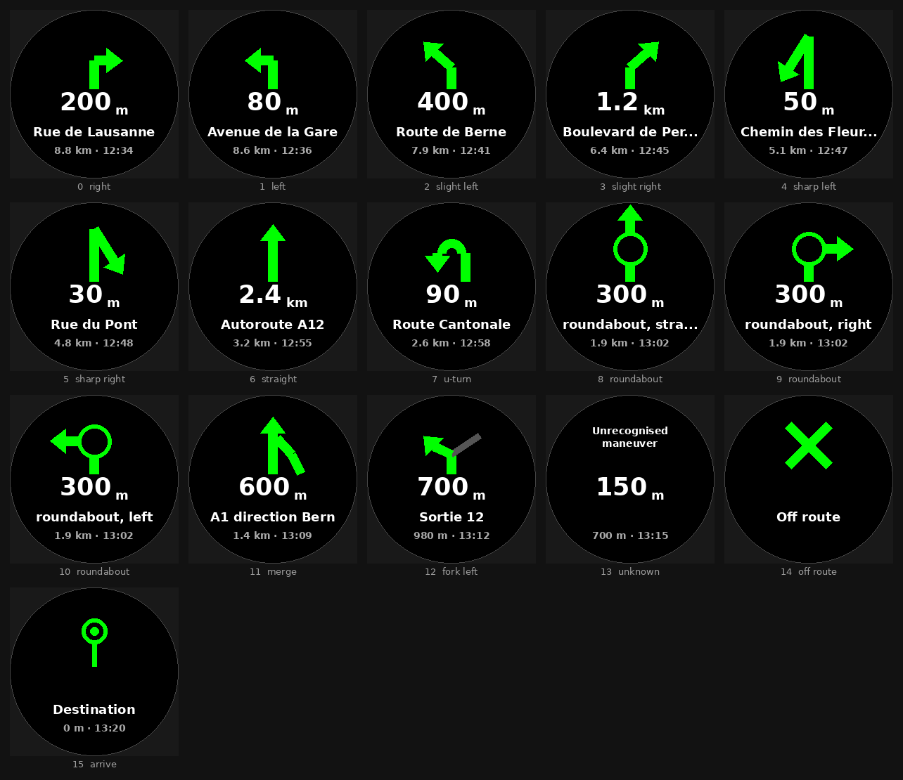
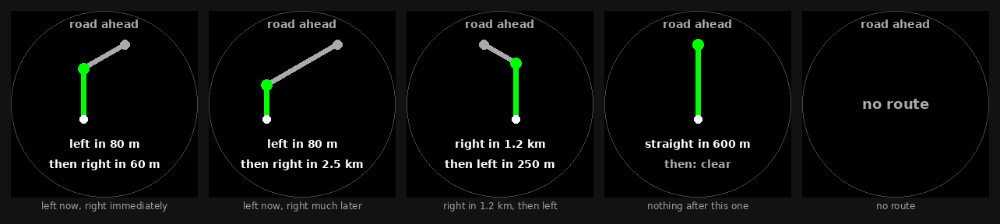

# Garmin Forerunner 745 projects

Two Connect IQ apps and the Android companion that feeds one of them.

| | |
|---|---|
| Watch | Forerunner 745, part `006-B3589-00`, firmware 13.70 |
| SDK device id | `fr745` — API level 3.3.1, 240x240 round MIP, 64 colours |
| Connect IQ SDK | 9.2.0, run from a container (see below) |

## [capability-explorer/](capability-explorer/)

Reports what this watch actually exposes to Connect IQ: screen geometry,
available Toybox modules, live sensors, activity data, system stats. Built to
answer "what can I use here?" by asking the device rather than reading a
compatibility table. Runs on the watch.

Its [docs/findings.md](capability-explorer/docs/findings.md) is the useful
artefact: which modules are fatal to probe, the real permission vocabulary for
a watch-app, and why side-loading cannot go through gvfs on Ubuntu 25.04.

## [maps-relay/](maps-relay/) + [android/](android/)

Shows OsmAnd turn-by-turn directions from the phone on the watch.

```
OsmAnd (Android)
  ├─ AIDL updateNavigationInfo ──▶ maneuver + metres to the turn
  ├─ AIDL getAppInfo() ──────────▶ street, distance left, ETA,
  │                                 and the turn *after* the next one
  └─ ongoing notification ───────▶ route running? (presence only)
                  │
                  └─ Relay: dedupe on the displayed value, one send at a time
                      └─ Connect IQ SDK ──▶ Garmin Connect ──BLE──▶ watch
                                                                     └─ NavView
```

Every field is typed. Nothing is parsed out of text any more: the notification
is read only for *whether* one exists, which is how the start and end of a
route are noticed.

This used to read Google Maps' navigation notification. Maps publishes no
guidance API, so the only way in was to intercept a notification written for
human eyes and reverse-engineer it — and it broke twice: v0.7 on `RemoteViews`
inflation, v0.8 on assuming the title held what the notification *renders* as.
The maneuver was never in there as data at all; it arrived as an icon bitmap
that had to be classified from its pixels.

OsmAnd exposes a documented AIDL interface instead. `registerForNavigationUpdates`
pushes `ADirectionInfo{distanceTo, turnType}` on every turn change, so the two
fields the arrow and the haptics depend on are integers from an app that means
to provide them. The notification is demoted to street and ETA, which it can
lose without costing you a turn.

The trade is real: no traffic-aware ETA, weaker destination search, and offline
maps must be downloaded in OsmAnd first. The `fr745` has no `WatchUi.MapView`,
so there is still no moving map — turn arrow, distance, street and ETA.

The maneuver codes in `maps-relay/source/Maneuver.mc` and
`android/app/src/main/java/com/mapsrelay/companion/Maneuver.kt` are the contract
between the two halves and must stay in step. `Maneuver.fromTurnType` maps
OsmAnd's `TurnType` onto them.

OsmAnd's AIDL contract is vendored under `android/app/src/main/aidl/` rather
than pulled from a dependency — see the README there for why, and how to
refresh it.

### Seeing the arrows without the simulator

The Connect IQ simulator's device panel does not render in this environment,
which left the turn arrows unverifiable. `maps-relay/tools/preview.py` mirrors
the `Maneuver.draw` and `NavView` arithmetic and draws the same screens offline
at the fr745's real 240x240:

```bash
cd maps-relay && python3 tools/preview.py docs/arrows.png
```



### Page 2: the road ahead

UP/DOWN switch pages. The second is a sketch of the next two maneuvers, dead
reckoned from their distances and turn angles:



It is not a map, and cannot be: the fr745 has no `WatchUi.MapView`, and OsmAnd
exposes no route geometry — `getActiveGpx` returns GPX files, not the route
being navigated. What it does expose is two upcoming turns with an angle each,
which is enough to draw the shape of what is coming.

The point is the first two panels above. They are the same instruction —
"left in 80 m" — and page 1 renders them identically. Only here can you see
that one is followed by another turn 60 m later and the other by 2.5 km of
clear road. Leg lengths are square-root compressed and the whole path is scaled
to fit, so it is schematic: right in order and direction, deliberately not to
scale.

It is a model, not the app: it catches geometry and layout mistakes (heads
detached from shafts, glyphs that read as the wrong symbol, text overflowing
the round screen), not Monkey C behaviour. Nor does it model the device fonts —
it draws everything in DejaVu, which is why it showed "200 m" for a long time
while the watch rendered "200": `FONT_NUMBER_MEDIUM` has no letters in it.

This is now the only way to see the arrows without a route. The watch app used
to cycle canned instructions on UP/DOWN, which was useful scaffolding before
the relay worked and a hazard afterwards — a stray button press mid-route
replaced the live instruction with a fabricated one that looked just as
authoritative.

## Building

**Watch apps** — the SDK runs in a container because the Connect IQ simulator
links `libwebkit2gtk-4.0`, which Ubuntu 25.04 no longer ships:

```bash
cd maps-relay        # or capability-explorer
make build           # compile for fr745, strict type checking
make sim             # launch the simulator
make run             # build + load into the running simulator
make sideload        # build + push onto the watch over MTP
make watch-log       # pull the watch's Connect IQ log
```

Side-loading bypasses gvfs (which cannot write MTP here) and drives `libmtp`
directly — no root needed.

**Android companion** — built by GitHub Actions, not locally. Every push
touching `android/` publishes a debug APK to the `apk` release; download
`maps-relay.apk` on the phone and open it.

## Phone setup

1. Install **OsmAnd** and download the offline maps for your area.
2. Install the APK from the `apk` release.
3. Open Maps Relay, tap **Grant notification access**, enable it.
4. **In OsmAnd: Menu → Plugins → Maps Relay → enable.** OsmAnd gates its API
   per calling app: the first time we ask it registers us *disabled*, persists
   that, and refuses, so this step is mandatory and there is no prompt for it.
   Maps Relay only appears in that list after it has tried once — so open Maps
   Relay first, which step 3 already does. The status screen goes from
   `NOT ENABLED` to `connected, receiving turns` within a few seconds of the
   toggle; no restart needed.
5. Garmin Connect Mobile must be installed, signed in and paired — it is the
   transport, there is no alternative.
6. Open **Maps Relay** on the watch, then start navigating in OsmAnd.

Tap **Send test message to watch** to check the link before trusting it on a
route.
